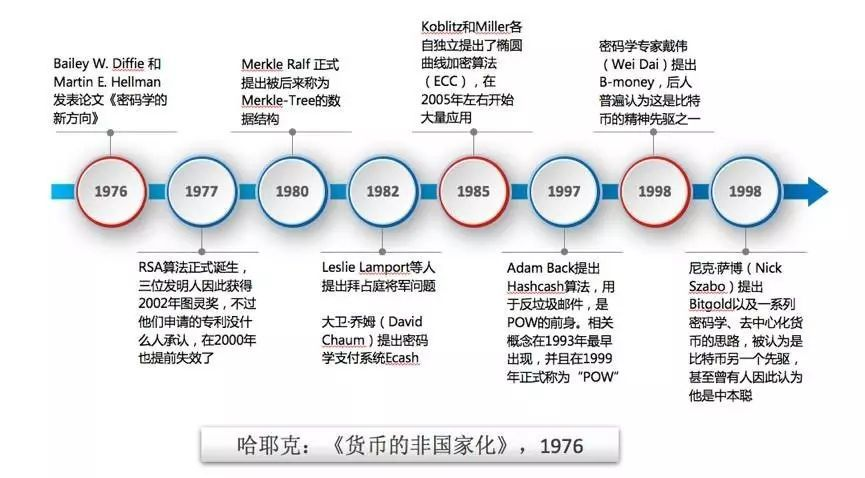
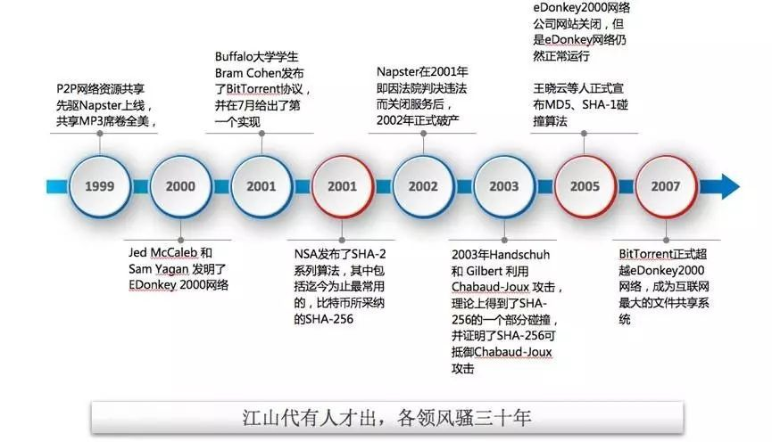
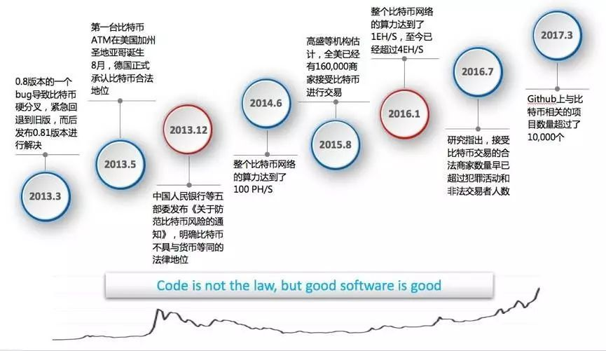
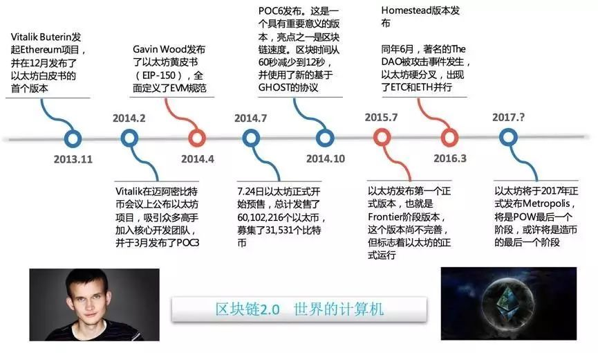
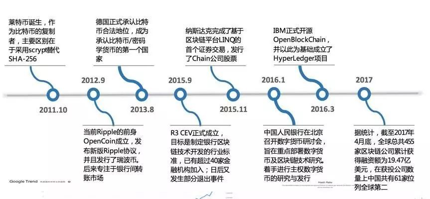
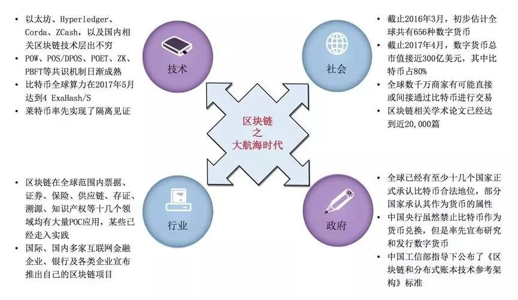
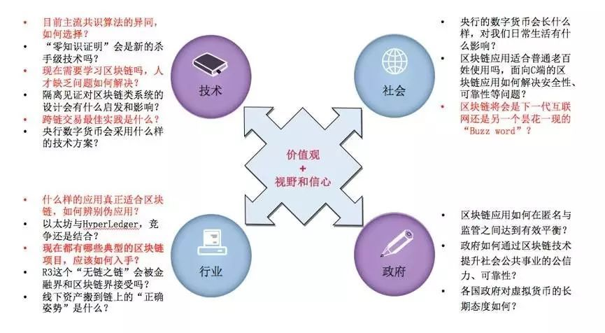

# 区块链简史

# 史前记事

1976年，Bailey W. Diffie、Martin E. Hellman两位密码学的大师发表了论文《密码学的新方向》，论文覆盖了未来几十年密码学所有的新的进展领域，包括非对称加密、椭圆曲线算法、哈希等一些手段，奠定了迄今为止整个密码学的发展方向，也对区块链的技术和比特币的诞生起到决定性作用。
同年，发生了另外一件看似完全不相关的事情——哈耶克出版了他人生中最后一本经济学方面的专著：《货币的非国家化》。对比特币有一定了解的人都知道，货币的非国家所提出的非主权货币、竞争发行货币等理念，或者说是去中心化货币的精神指南。
紧接着在1977年，著名的[RSA算法](https://baike.baidu.com/item/RSA%E7%AE%97%E6%B3%95/263310?fr=aladdin)诞生，这应该说是1976年《密码学的新方向》的自然延续，一点不令人惊讶，三位发明人也因此在2002年获得了图灵奖。不过，他们为RSA申请的专利，在世界上普遍认同算法不能申请专利的环境下，确实没什么人承认，在2000年也提前失效了。
到了1980年，Merkle Ralf提出了[Merkle-Tree](https://en.wikipedia.org/wiki/Merkle_tree)这种数据结构和相应的算法，后来的主要用途之一是分布式网络中数据同步正确性的校验，这也是比特币中引入用来做区块同步校验的重要手段。值得指出的是，在1980年的时候，真正流行的哈希算法、分布式的网络都还没有出现，例如：我们熟知的SHA-1、MD5这样的东西都是90年代诞生的。在那个年代Merkle就发布了这样一个数据结构，后来对密码学和分布式计算领域起到重要作用，多少有些令人惊讶。不过，如果大家了解Merkle的背景，就知道这事决非偶然：他就是《密码学新方向》的两位作者之一Hellman的博士生（另一位作者Diffie是Hellman的研究助理），实际上《密码学的新方向》就是Merkle Ralf的博士生研究方向。据说Merkle实际上是《密码学的新方向》主要作者之一，只是因为当时是博士生，没有收到发表这个论文的学术会议的邀请，才没能在论文上署名，也因此与40年之后的图灵奖失之交臂。
1982年，Lamport提出[拜占廷将军问题](https://baike.baidu.com/item/%E6%8B%9C%E5%8D%A0%E5%BA%AD%E5%B0%86%E5%86%9B%E9%97%AE%E9%A2%98/265656?fr=aladdin)，标志着分布式计算的可靠性理论和实践进入到了实质性阶段。同年，大卫·乔姆提出了密码学支付系统[ECash](https://en.wikipedia.org/wiki/Ecash)，可以看出，随着密码学的进展，眼光敏锐的人已经开始尝试将其运用到货币、支付相关的领域了，应该说ECash是密码学货币最早的先驱之一。
1985年，Koblitz和Miller各自独立提出了著名的[椭圆曲线加密（ECC）算法](https://baike.baidu.com/item/%E6%A4%AD%E5%9C%86%E6%9B%B2%E7%BA%BF%E5%AF%86%E7%A0%81%E5%AD%A6/2249951?fr=aladdin)。由于此前发明的RSA的算法计算量过大很难实用， ECC的提出才真正使得非对称加密体系产生了实用的可能。因此，可以说到了1985年，也就是《密码学的新方向》发表10年左右的时候，现代密码学的理论和技术基础已经完全确立了。
有意思的是，1985-1997年这段时期，密码学、分布式网络以及与支付／货币等领域的关系方面，没有什么特别显著的进展。在笔者看来，这种现象很容易理解：新的思想、理念、技术的产生之初，总要有相当长的时间让大家去学习、探索、实践，然后才有可能出现突破性的成果。前十年往往是理论的发展，后十年则进入到实践探索阶段，1985-1997这十年左右的时间，应该是相关领域在实践方面迅速发展的阶段。最终，从1976年开始，经过20左右的时间，密码学、分布式计算领域终于进入了爆发期。
1997年，[HashCash](https://en.wikipedia.org/wiki/Hashcash)方法，也就是第一代[POW（Proof of Work）](https://mp.weixin.qq.com/s?__biz=MzA4NjEzNzc1Nw==&mid=2650968236&idx=1&sn=7bfc43aa33f9fb77e5a7ff695372bcdb&chksm=843b7e5eb34cf748e414fec7bb11e12765bf4f4ac6232c04d7cb9c1109424e1a8624a48571cc&scene=21#wechat_redirect)算法出现了，当时发明出来主要用于做反垃圾邮件。在随后发表的各种论文中，具体的算法设计和实现，已经完全覆盖了后来比特币所使用的POW机制。
到了1998年，密码学货币的完整思想终于破茧而出，戴伟（Wei Dai）、尼克·萨博同时提出密码学货币的概念。其中戴伟的B-Money被称为比特币的精神先驱，而尼克·萨博的Bitgold提纲和中本聪的比特币论文里列出的特性非常接近，以至于有人曾经怀疑萨博就是中本聪。有趣的是，这距离后来比特币的诞生又是整整10年时间。

# 技术发展

在二十一世纪到来之际，区块链相关的领域又有了几次重大进展：首先是点对点分布式网络，1999到2001的三年时间内，Napster、EDonkey 2000和BitTorrent分别先后出现，奠定了P2P网络计算的基础。
2001年另一件重要的事情，就是NSA发布了SHA-2系列算法，其中就包括目前应用最广的SHA-256算法，这也是比特币最终采用的哈希算法。应该说说到了2001年，比特币或者区块链技术诞生的所有的技术基础在理论上、实践都被解决了，比特币呼之欲出。
在人类历史中经常会看到这样的现象，从一个思想、技术被提出来，到它真正发扬光大，差不多需要30年左右的时间。不光是技术领域，其他如哲学、自然科学、数学等领域，这种现象也是屡见不鲜，区块链的产生和发展也是遵从了这个模式。这个模式也很容易理解，因为一个思想、一种算法、一门技术诞生之后，要被人消化、摸索、实践，大概要用一代人的时间。

# 比特币的诞生：区块链1.0

中本聪在2008年11月的时候发表了著名的论文[《比特币：点对点的电子现金系统》](https://bitcoin.org/bitcoin.pdf)，2009年1月紧接着用他第一版的软件挖掘出了创始区块，包含着这句：“The Times 03/Jan/2009 Chancellor on brink of second bailout forbanks.”，像魔咒一样开启了比特币的时代。了解比特币历史的人应该比我还熟悉。对于比特币的发展过程，有几个我认为重要的时间节点：
2010年9月，第一个矿场Slush发明了多个节点合作挖矿的方式，成为比特币挖矿这个行业的开端。要知道，在此之前的2010年5月，1万比特币才值25美元，如果按照这个价格来计算，全部的比特币（2100万）也就值5万美元，集中投入挖矿显然是没有任何意义的。因此，建立矿池的决定就意味着有人认定比特币未来将成为某种可以与真实世界货币相兑换的，具有无限增长空间的虚拟货币，这无疑是一种远见。
2011年4月，比特币官方有正式记载的（https://bitcoin.org/en/version-history）第一个版本：0.3.21发布，这个版本非常初级，然而意义重大。首先，由于他支持uPNP，实现了了我们日常使用的P2P软件的能力，比特币才真正能登堂入室，进入寻常百姓家，让任何人都可以参与交易。其次，在此之前比特币节点最小单位只支持0.01比特币，相当于“分”，而这个版本真正支持了“聪”。可以说从这个版本之后，比特币才成为了现在的样子，真正形成了市场，在此之前基本上是技术人员的玩物。

# 比特币发展史

2013年，比特币发布了0.8的版本，这是比特币历史上最重要的版本，它整个完善了比特币节点本身的内部管理、网络通讯的优化。也就是在这个时间点以后，比特币才真正支持全网的大规模交易，成为中本聪设想的电子现金，真正产生了全球影响力。
事情总是没有那么一帆风顺，在最重要的0.8版本，比特币引入了一个大bug，所以这个版本发布以后比特币短时间就出现了硬分叉，导致整个比特币最后不得不回退到旧的版本，这个也导致了比特币价格产生大幅下跌。
比特币后面的发展被越来越多的人所熟知，例如：世界各国对它的态度、算力的增长——2016年1月达到1EH/S，以及在Github上超过了1万个相关的开源项目，都证明比特币生态环境已经完全成熟了。
从上面这些角度去看比特币的历史，也许你会产生和我相同的感受：不管中本聪的魔咒有多么强大，数字/密码学货币多么有前途，还要依靠软件本身一点一滴的发展。如果软件本身有致命bug，最终整个的系统都会变得毫无意义。现在大家能看到越来越多的虚拟货币，各种各样的ICO，我希望给大家传递的信息是，至少要看一看它们软件水平怎么样，不然的话跟庞氏骗局区别不大——软件好，才是真的好。

# 以太坊的诞生:区块链2.0

Vatalik Buterin（后来被大家尊称为"V神"的那个天才程序员）于 2013 年末发布了[以太坊](https://github.com/ethereum/wiki/wiki/White-Paper)的白皮书.
以太坊的设计的目标就是区块链2.0，是一个全球范围内的分布式计算机，有着堪称完美的路线图和系统结构。当然，最终能不能实现其设计目标，还有待于观察。

# 区块链的进一步爆发

# 区块链3.0时代的到来

在基于智能合约等基础设施构建上，隐藏了底层技术的复杂性，更多区块链技术转移到应用的落地上，而区块链3.0的代表就是柚子EOS，ArcBlock，小蚁NEO，比原链BTM等。

# 区块链未来

# 总结
区块链1.0：没有任何的应用功能，以数字货币回报为王。
区块链2.0：智能合约为上层应用开发提供基础设施支持。块链2.0就是可编程区块链。以以太坊为代表，在互联网上搭建操作系统，它只是提出了一个概念，并没有实现真正的应用，或者说不满足应用要求。区块链2.0最大的贡献就是通过智能合约来彻底颠覆了传统货币和支付的概念。
区块链3.0：区块链2.0对数字身份、智能合约等基础设施进行了构建，在此基础上，隐藏了底层技术的复杂性，应用开发者可以更多地专注在应用逻辑及商业逻辑层面。也就是进入了区块链3.0时代，标志就是出现了Token(Token是区块链网络上的价值传输载体，也可以理解为通证或代币。)。

