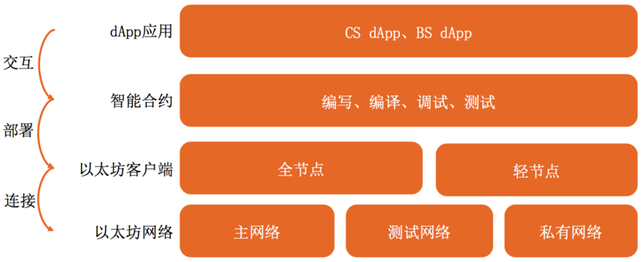
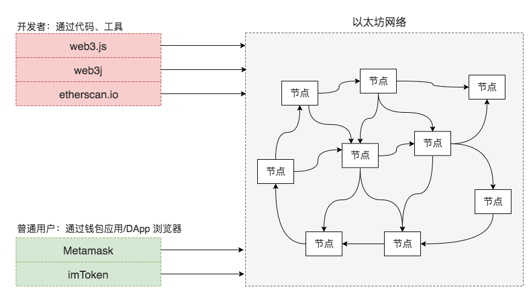
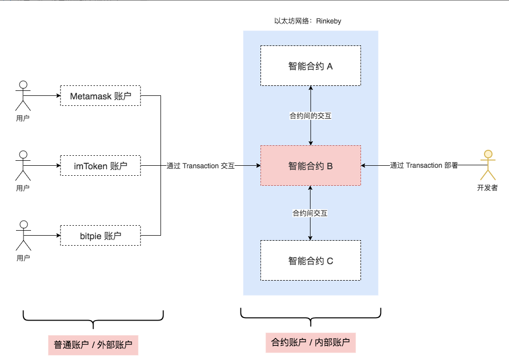

# 以太坊核心概念和原理

# 以太坊网络
以太坊是一个去中心化的区块链平台，其区块链由一个全网的P2P网络维护，网络中的每一个节点均以对等的身份参与以太坊的运行，形成一个全球的以太坊虚拟机（EVM）。货币交易、合约的发布等均通过该P2P网路来验证、传播、存储。
根据应用场景的不同，以太坊网络又包括：主网络、测试网络、私有网络:
* 主网络
主网络是以太坊真正运行的网络，真实的以太坊转账、合约部署等发生在这个网络。此网络涉及真实的以太坊币
* 测试网络
测试网络是专门为测试目的建立的，比如一个智能合约在正式部署到主网络之前，应该先在测试网络充分测试。此网络使用测试币，不会涉及真实以太坊币。典型的测试网络有[ Rinkeby、Ropsten、Kovan](https://testnet.etherscan.io/)。不管是主网络还是测试网络，其都是一个由多个节点参与的P2P网络，只是测试网络中挖矿难度比主网络中更容易些，使得测试更快速。而私有网络则更简洁，直接在本地模拟搭建一个以太坊区块链，不用连接到P2P网络，挖矿速度可以随意调节设置，使得开发测试更高效。
* 私有网络
就是以太坊的开发环境，常通过开发者在本地运行以太坊节点组成，或者使用各种便捷的工具启动的本地测试网，以及以内部测试为目的而搭建的私有网络等。

# 如何与以太坊网络交互
以太坊生态中，开发者、普通用户、平台之间的交互方式

# 以太坊客户端
若想使用以太坊提供的服务，不论是转账还是部署合约，都需要用以太坊客户端加入到以太坊网络中，说白了以太坊客户端就是实现了以太坊协议的软件，其概念可类比平时使用的P2P下载客户端。以太坊客户端可概述为：
* 全节点客户端
全节点客户端加入到以太坊网络时，会把以太坊全部的区块链数据都同步到本地，因此对配置的要求比较高。全节点支持的功能非常齐全，并且其安全性比较高，因为是直接和以太坊网络交互，中间不需要经过第三方。
* 轻节点客户端
轻节点客户端不会同步整个以太坊网络，它通过连接到其它的全节点来提供服务，因此其提供的服务往往有限，常常用于钱包场景。

# 智能合约
智能合约可以理解为在区块链上可以自动执行的（由消息驱动的）、以代码形式编写的合同（特殊的交易）,它是代码和数据(状态)的集合。
智能合约使用高级语言编写（如solidity（以太坊计划未来将从Solidity转移到Viper。），浏览器的Solidity IDE：[Browser-Solidity](http://remix.ethereum.org/#optimize=false&version=builtin)），然后编译成可以在EVM(Ethereum Virtual Machine:以太坊虚拟机是以太坊中智能合约的运行环境)上运行的字节码，在充分地调试和测试后进行发布，其概念可类比Java代码与JVM。
智能合约的部署是指把合约字节码发布到区块链上，并使用一个特定的地址来标示这个合约，这个地址称为合约账户。
以太坊中有两类账户：
* 外部账户：该类账户被私钥控制（由人控制），没有关联任何代码。
* 合约账户：该类账户被它们的合约代码控制且有代码与之关联。

外部账户与合约账户的区别和关系：一个外部账户可以通过创建和用自己的私钥来对交易进行签名，来发送消息给另一个外部账户或合约账户。
在两个外部账户之间传送消息是价值转移的过程。但从外部账户到合约账户的消息会激活合约账户的代码，允许它执行各种动作（比如转移代币，写入内部存储，挖出一个新代币，执行一些运算，创建一个新的合约等等）。
只有当外部账户发出指令时，合同账户才会执行相应的操作。
合约部署就是将编译好的合约字节码通过外部账号发送交易的形式部署到以太坊区块链上（由实际矿工出块之后，才真正部署成功）。

# gas
gas是衡量执行某些操作所需的计算量的单位，用来计算为了执行操作而需要支付给网络的费用数额。
通俗理解，Gas 是给矿工的佣金，并以 ETH 支付，无论是交易、执行智能合约并启动 DApps，还是支付数据存储费用，都需要用到 Gas。
Gas的目的是限制执行交易所需的工作量，同时为执行支付费用。当EVM执行交易时，Gas将按照特定规则被逐渐消耗，无论执行到什么位置，一旦Gas被耗尽，将会触发异常。当前调用帧所做的所有状态修改都将被回滚， 如果执行结束还有Gas剩余，这些Gas将被返还给发送账户。
每笔交易都包含gas limit和gas price。矿工可以有选择的打包这些交易并收取这些费用。gasprice 会影响到该笔交易被打包所需等待的时间。如果该交易的操作所使用的gas数量小于或等于所设置的gas limit，交易会被处理。但如果gas总消耗超过gas limit，所有的操作都会被重置，但手续费依旧会被收取。

# Dapp
以太坊社区把基于智能合约的应用称为去中心化的应用程序(Decentralized App)。一个Dapp不单单有智能合约，还需要有一个友好的用户界面和其他的东西。
## Truffle
Truffle是Dapp开发框架，他可以帮我们处理掉大量无关紧要的小事情，让我们可以迅速开始写代码-编译-部署-测试-打包DApp这个流程。

