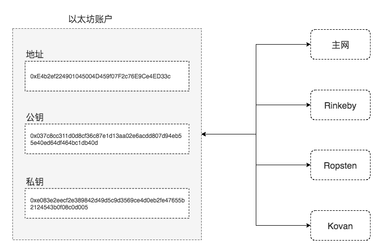
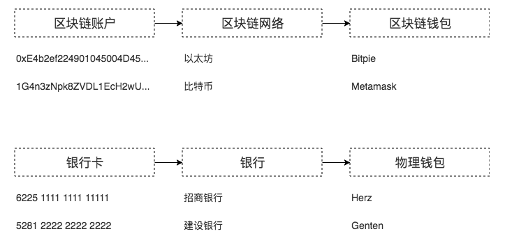
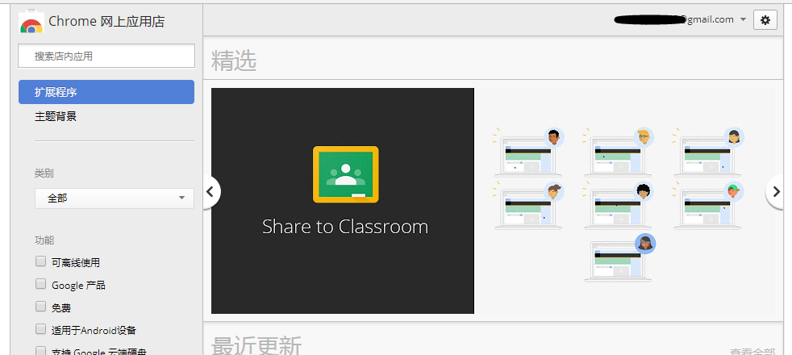
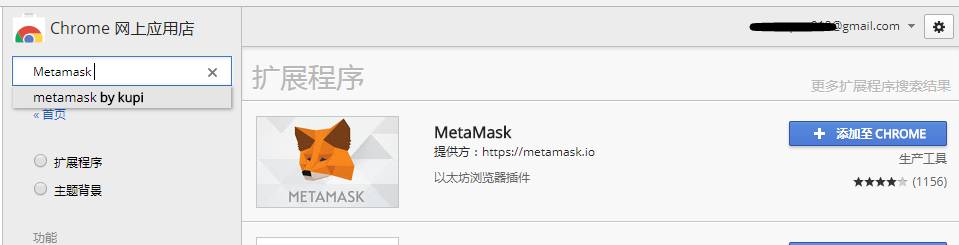
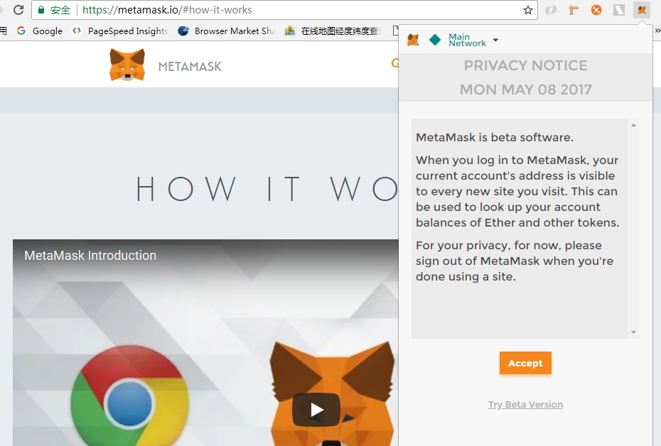
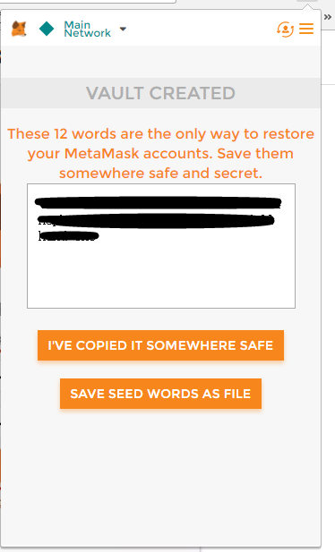
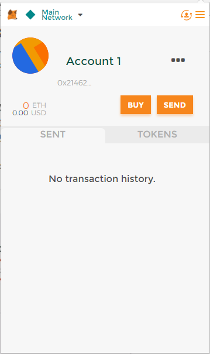

# 使用 Metamask 创建第一个以太坊 HD 钱包

接触任何区块链网络都需要我们有自己的账户，管理账户的软件可称之为钱包，在创建钱包和账户之前，我们有必要了解下以太坊网络中账户的组成：

以太坊网络中的账户和典型的区块链账户没有太大区别，都由地址、公钥、私钥 3 部分构成，不论使用何种钱包创建的以太坊账户，在不同的以太网网络之间都是可以通用的，比如我在主网上创建了钱包账户，而切换到 Rinkeby 测试网络时依然可以使用同样的账户。

不论是在以太坊网络上发起转账交易，还是部署智能合约，亦或是调用智能合约中的函数，我们都需要有账户，方便以太坊记录和验证谁、在什么时间、做了什么。

区块链世界里面的钱包其实借鉴自现实世界的钱包:

# 创建钱包和账户
1. 打开chrome，打开[chrome网上应用店](https://chrome.google.com/webstore/category/extensions)

2. 搜索Metamask并添加，添加完成则插件会显示(温馨提示：认准这个logo)

3. 然后一直输入密码再到助记词(温馨提示：助记词是用来生成账户的公钥和私钥的，也是用来恢复钱包里面的所有账户的。另如果他人拿了你的助记词，就相当于拿到了你的钱包，所以要妥善保管。)

4. 最后钱包和账户

备注：另外也可直接搜[Metamask ](https://metamask.io/)(以太坊浏览器钱包插件)进行安装chrome钱包插件

