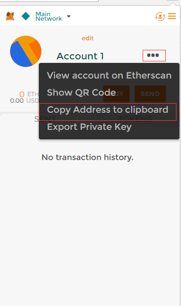
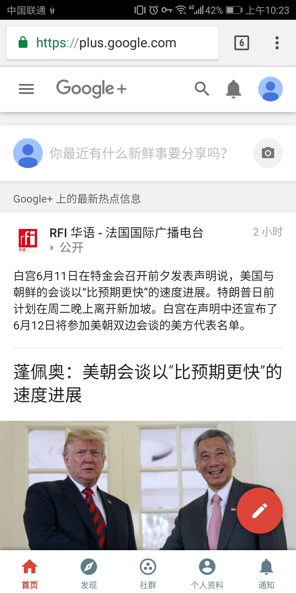
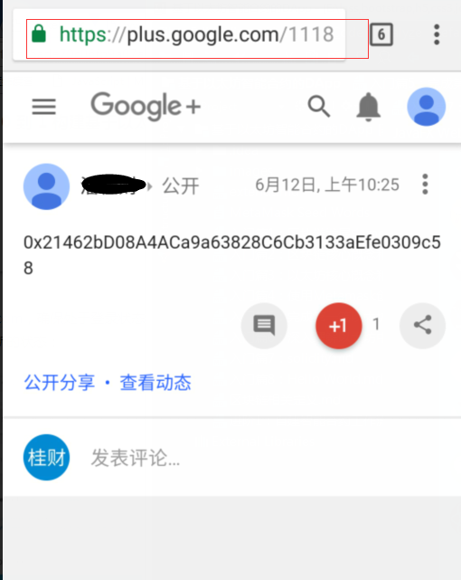
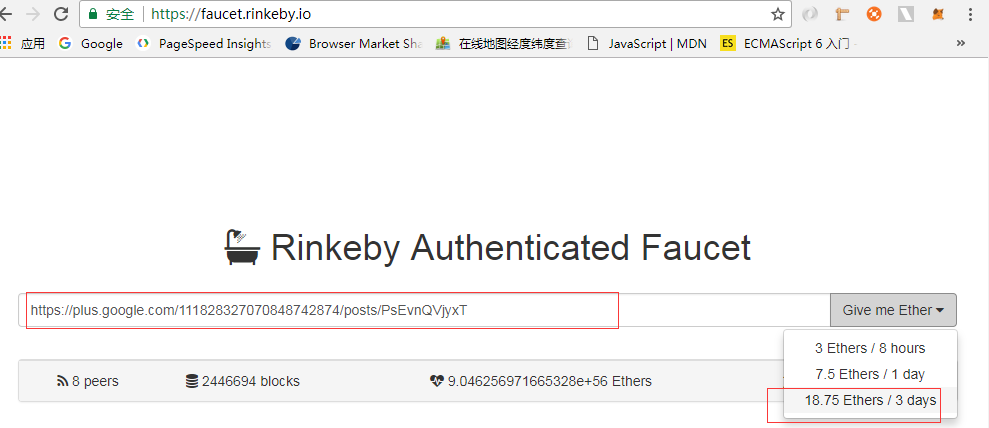
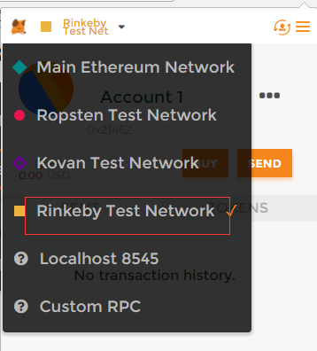
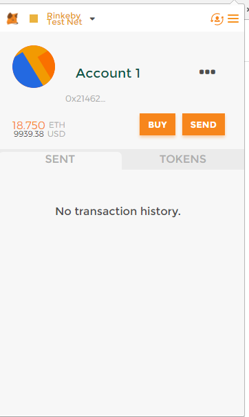

# 完成第一笔以太坊交易

## 测试网络免费充值的方式
1. [rinkeby-faucet.com](http://rinkeby-faucet.com/)
只要提供账户地址即可充值 0.001 ETH，理论上是可以无限制充值的，但是如果需要充值 1ETH，需要操作 1000 次，太费劲。
2. [faucet.rinkeby.io](https://faucet.rinkeby.io/)
可以提供多达 18 ETH 的充值金额，但是为了避免被滥用，要求接受充值的账户持有人必须以太坊账户地址发送到自己的社交网络中（如 Twitter、Facebook、Google Plus），同样，该工具限制了充值的频率。

## 使用faucet.rinkeby.io进行充值的流程
1. 复制地址

2. 分享到Google Plus
打开Google Plus并发布分享，并复制分享链接

3. 打开[faucet.rinkeby.io](https://faucet.rinkeby.io/)并填入分享链接，选择第三个

4. 重新打开Metamask钱包，切换到测试网络，即可查看到账号余额，即完成充值

