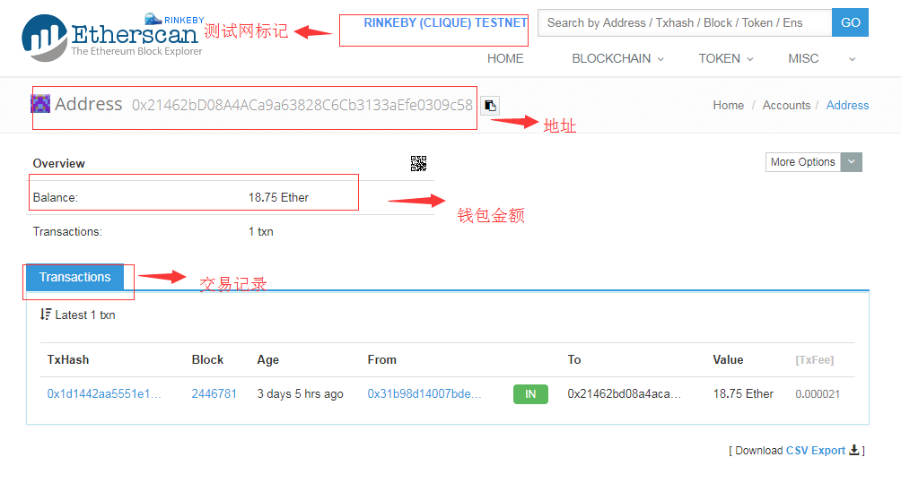
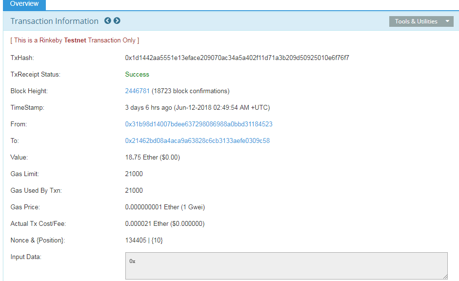

# 理解以太坊中的交易（Transaction）

## 查看交易记录
> 通过Metamask钱包-> View account on Etherscan来查看etherscan.io上的交易记录：

## 查看交易详情
> 然后通过点击相关的交易记录我们就可以查看详细的交易信息：

1. TxHash：交易流水号，类似于你去银行转账银行给你业务回执的那个流水号；
2. Block Height：说明这笔交易被打包进了编号（块高）为 2446781 的区块，括号中的 "18723 block confirmations" 表示在这笔交易被打包之后，以太坊的 Rinkeby 测试网上又产生了 18723 个区块（如果去审查这笔交易，看到的这个数字会不同，越晚看到数字会越大）
3. From/To/Value：说明交易的发起账户、接收账户，以及转账金额，如果是智能合约调用也会有这 3 个字段，但是会有说明调用了合约里面的什么函数；
4. Gas Limit/Used/Price 和 Actual Tx Cost：交易手续费相关的信息，其中 Gas 是交易手续费的单位，而 Ether、Gwei 则是以太坊中代币的单位，具体来说手续费相关的几个字段含义为：
4.1 Gas Limit 表示在交易执行时最多消耗的汽油数量，在智能合约的章节会有更详细的介绍；
4.2 Gas Used 表示实际使用了多少汽油；
4.3 Gas Price 表示汽油的价格是 0.000000001 Ether (或 1 Gwei)；
5. Actual Tx Cost 表示实际的转账手续费是 0.000000001 Ether。

## 关于gas的补充
> Gas 是以太坊虚拟机（EVM）内部流通的货币，以太坊虚拟机用 Gas 来对交易打包、智能合约执行等操作收取费用。

> 纯转账交易的手续费：以太坊上纯转账交易的 Gas 消耗是 21000 个单位，注意这里的纯转账，指转的是 ETH，不包括各种 ERC20 的代币，因为代币本身是智能合约，转账的时候需要调用智能合约的接口。

