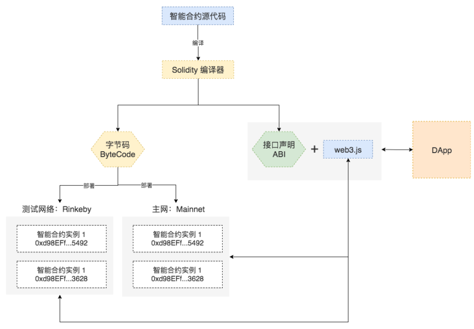

# Solidity
官网：[http://solidity.readthedocs.io/en/v0.4.24/](http://solidity.readthedocs.io/en/v0.4.24/)
Solidity 是面向合约的高级智能合约编程语言，其设计受到了 C++、Python、Javascript 语言的影响。它被设计成以编译的方式生成以太坊虚拟机代码。

## Solidity运行条件
Solidity 源代码要成为可以运行在以太坊上的智能合约需要经历如下的步骤：
* 用 Solidity 编写的智能合约源代码需要先使用编译器编译为字节码（Bytecode），编译过程中会同时产生智能合约的二进制接口规范（Application Binary Interface，简称为 ABI）；
* 通过交易（Transaction）的方式将字节码部署到以太坊网络，每次成功部署都会产生一个新的智能合约账户；

## 使用JavaScript编写DApp
使用 Javascript 编写的 DApp 通常通过 web3.js + ABI去调用智能合约中的函数来实现数据的读取和修改。

## 如何开发Solidity
* 入手方式（Remix集成开发环境）
Remix 是以太坊社区开发出来的在线智能合约集成开发环境，包含开发、部署、调试支持，官方还提供了桌面版，但桌面版仍然需要依赖网络才能正确运行；
* 标准前端开发环境
在前端开发环境中构建自己的智能合约的工作流，则需要组合使用现有的工具实现智能合约的编写、编译、部署、测试等环节。

