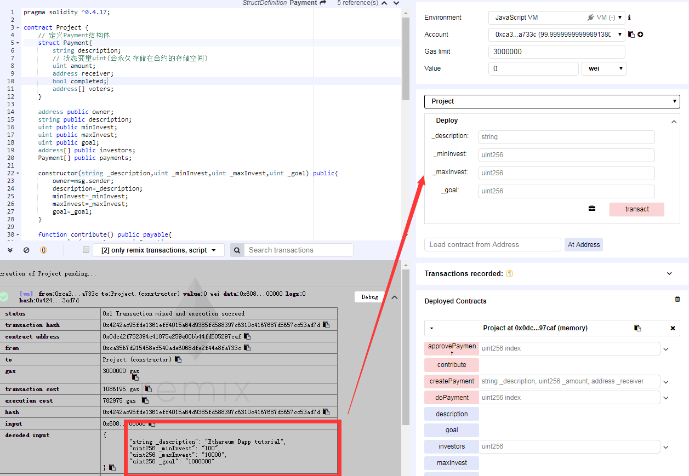
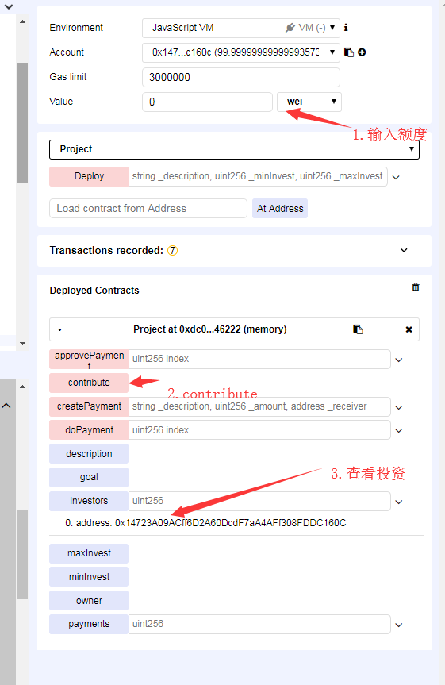
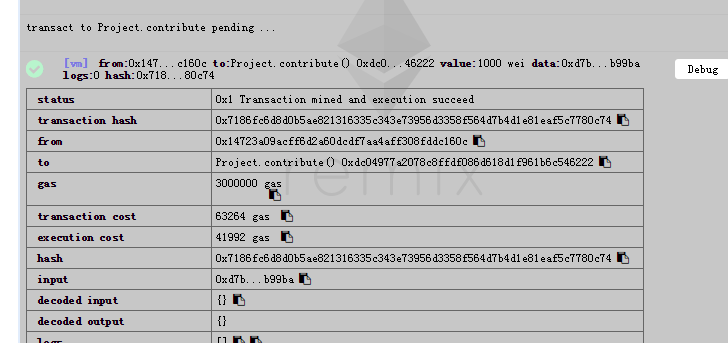
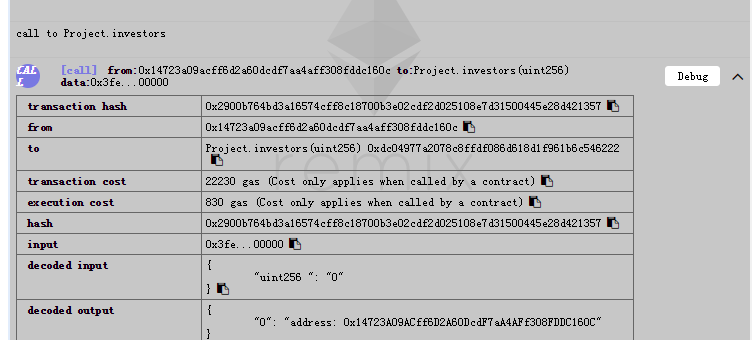
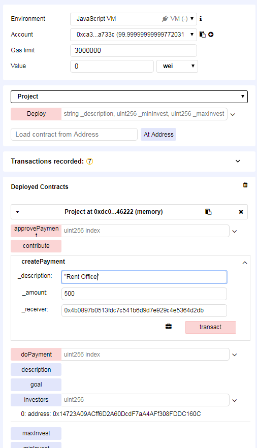
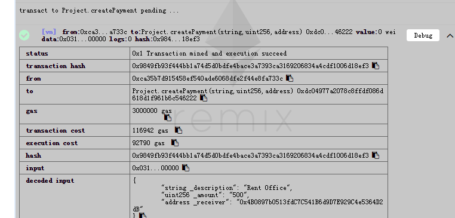
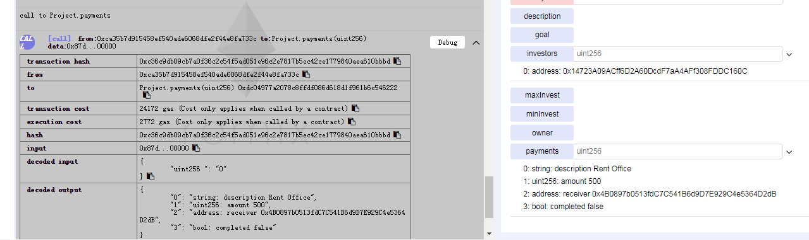

# ICO智能合约开发和Remix测试

## ICO合约初版
> 撸个简单的智能合约，完成ICO参与，发起资金支出，投票，完成支出等模块功能
`````
pragma solidity ^0.4.17;

contract Project {
    // 定义Payment结构体
    struct Payment{
        string description;
        // 状态变量uint(会永久存储在合约的存储空间)
        uint amount;
        address receiver;
        bool completed;
        address[] voters;
    }

    /**
    合约属性声明
    owner，项目所有者；
    description，项目介绍；
    minInvest，最小投资金额；
    maxInvest，最大投资金额；
    goal，融资上限；
    investors，投资人列表；
    payments，资金支出列表；
    **/
    address public owner;
    string public description;
    uint public minInvest;
    uint public maxInvest;
    uint public goal;
    address[] public investors;
    Payment[] public payments;

    // 定义构造器:在合约的构造器中，不能使用this调用函数，因为当前合约还没有创建完成
    constructor(string _description,uint _minInvest,uint _maxInvest,uint _goal) public{
        owner=msg.sender;
        description=_description;
        minInvest=_minInvest;
        maxInvest=_maxInvest;
        goal=_goal;
    }

    /**
    contribute:参与项目投资的接口
    投资人调用该接口时要求发送满足条件的资金，并且要求没有达到募资上线，这是所有合约接口中标记为 payable 的接口，即接受用户在交易中发送 ETH
    msg、require 是 Solidity中的全局变量，另还有block、now、tx等(见http://solidity.readthedocs.io/en/v0.4.24/units-and-global-variables.html#block-and-transaction-properties)
    msg包含了当前交易上的关键信息：
        msg.data，交易中携带的数据，在我们的代码中没有用到；
        msg.sender，发起交易的账户，在众筹合约中大量使用，记录投资者和投票；
        msg.value，交易发送的转账金额，比如投资金额检查就用到了，需要注意的是 msg.value 的单位是 wei...
    require : Solidity 提供的断言机制,如果不满足交易则回滚
    */
    function contribute() public payable{
        require(msg.value >= minInvest);
        require(msg.value <= maxInvest);
        require(address(this).balance <= goal);
        investors.push(msg.sender);
    }

    /**
    createPayment:发起资金支出请求
    要求传入资金支出的细节信息
    */
    function createPayment(string _description, uint _amount, address _receiver) public {
        Payment memory newPayment = Payment({
            description:_description,
            amount:_amount,
            receiver:_receiver,
            completed:false,
            voters:new address[](0)
            });
        payments.push(newPayment);
    }

    /**
    approvePayment:，投票赞成某个资金支出请求
    需要指定是哪条请求，要求投票的人是投资人，并且没有重复投票
    */
    function approvePayment(uint index) public{
        Payment storage payment=payments[index];
        bool isInvestor=false;
        for(uint i=0;i<investors.length;i++){
            isInvestor=investors[i] == msg.sender;
            if(isInvestor){
                break;
            }
        }
        require(isInvestor);

        bool hasVoted =false;
        for(uint j=0;j<payments.length;j++){
            hasVoted=payment.voters[j]==msg.sender;
            if(hasVoted){
                break;
            }
        }
        require(!hasVoted);
        payment.voters.push(msg.sender);
    }

    /**
    doPayment:完成资金支出
    需要指定是哪笔支出，即调用该接口给资金接收方转账，不能重复转账，并且赞成票数超过投资人数量的 50%
    */
    function doPayment(uint index) public{
        Payment storage payment=payments[index];
        require(!payment.completed);
        require(payment.voters.length > (investors.length / 2));
        payment.receiver.transfer(payment.amount);
        payment.completed=true;
    }
}


`````

## Remix合约校验
> 将智能合约源码放到[Remix](https://remix.ethereum.org/)上进行测试
1. 项目方身份创建:填写Deploy部署相关字段（描述，最低最高投资及总额等），transact办理即可

2. 投资项目:
    1. contribute 不需要填写参数，但是需要我们填写转账交易金额
    2. contribute 接口调用本质是发起了 Transaction，界面上看不到反馈，但在交易日志区域能看到新内容(截图2)
    3. investors查看投资人的信息(截图3)



3. 请求支出资金:
    1. createPayment中填写对应参数
    2. payments查看详细的交易记录



4. 资金请求投票(切换到投资人身份，给资金支出请求投票)/资金划转(项目方的身份，对投完票的资金支出进行资金划转)
    1.切换账号，approvePayment[0]进行投票并payments[0]查看状态
    2.切换项目方账号，doPayment[0]完成资金支出并payments[0]查看状态


