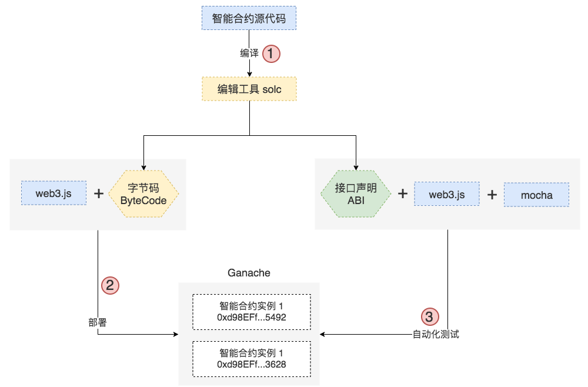
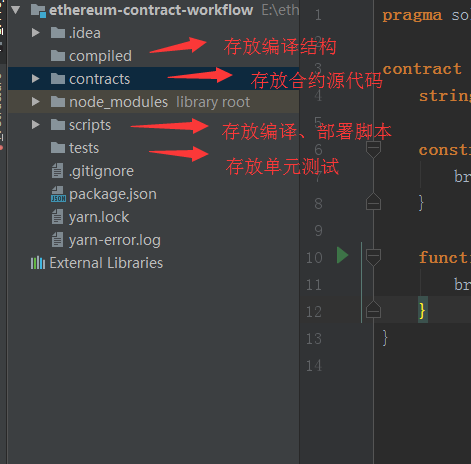

# 自建智能合约工作流

## Remix局限性
* 源代码没有版本控制，实际上不存在编写一次就不用修改的代码，没有版本控制就是取乱之道；
* 智能合约只能在浏览器中运行，比如我们不能方便的把合约部署到以太坊的主网或测试网络上；
* 智能合约的测试都是手动的，手动的过程通常是不可靠的，如果有自动化的智能合约测试就好了；

## Truffle难点
[Truffle](http://truffleframework.com/)类似于前端的各种全家桶，帮助我们将webpack，vue等组装好。我们只需要在上面开发相关的应用逻辑即可。但是，这就带来了另一个问题，学习曲线陡，对于新入手区块链的难度就非常大了。

## 打造工作流
实现自己的智能合约编译、部署、测试工作流：

重点解决的流程（3个红色圆圈标记）：
1. 要能够把 Solidity 源代码编译成 Bytecode 和 ABI，这个过程使用工具 [solc](https://www.npmjs.com/package/solc)
2. 要能够把编译后的 Bytecode 部署到本地测试网络（[ganache-cli](https://www.npmjs.com/package/ganache-cli)）、公共测试网络（[rinkeby](https://www.rinkeby.io/#stats)），里面要用到 [web3.js](https://www.npmjs.com/package/web3)
3. 要能够在单元测试中和部署完的智能合约实例交互，需要组合使用 web3.js 和 [mochajs](https://www.npmjs.com/package/mocha)；
备注： ganache-cli 是 Truffle 框架的一部分，能够让开发者快速启动本地测试网络，而不需要大费周章的在本地运行以太坊节点；web3.js 在合约部署和自动化测试时会被大量使用。

## 环境准备
### 目录结构
1. 初始化package.json
``
npm init -y
``
2. 根目录新建.gitignore文件，内容：node_modules
3. 目录说明

4. 安装编译工具[solc](https://www.npmjs.com/package/solc)
``
yarn add solc
``
5. 编译结果保存[fs-extra](https://www.npmjs.com/package/fs-extra)
``
yarn add fs-extra
``
6. 安装部署依赖[web3..js](https://web3js.readthedocs.io/en/1.0/getting-started.html)，若安装不成功可尝试 ``npm install web3@1.0.0-beta.34 --save``
``
yarn add web3@1.0.0-beta.34
``
7. 为了兼容钱包，并且和Infura节点通讯的web3.js插件，安装[truffle-hdwallet-provider](https://www.npmjs.com/package/truffle-hdwallet-provider)作为provider，该插件支持通过助记词去管理账户：
``
yarn add truffle-hdwallet-provider@0.03
``
备注：若安装不成功，则可能需要使用管理员身份执行命令``npm install --global --production windows-build-tools`去安装工具

8. 使用 mocha + web3.js + ganache 编写合约测试，安装依赖[ganache-cli](https://www.npmjs.com/package/ganache-cli)、mocha
``
yarn add ganache-cli mocha -D
``
