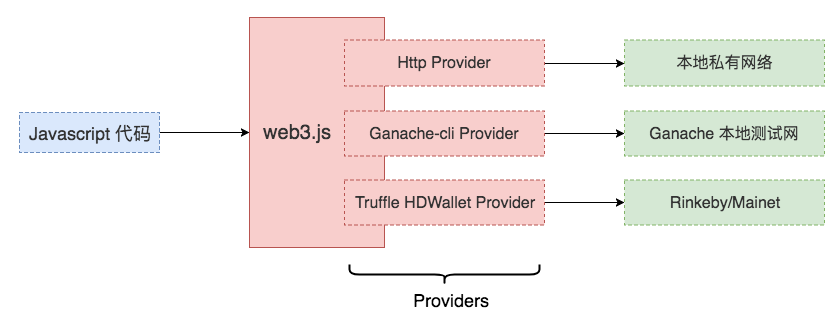
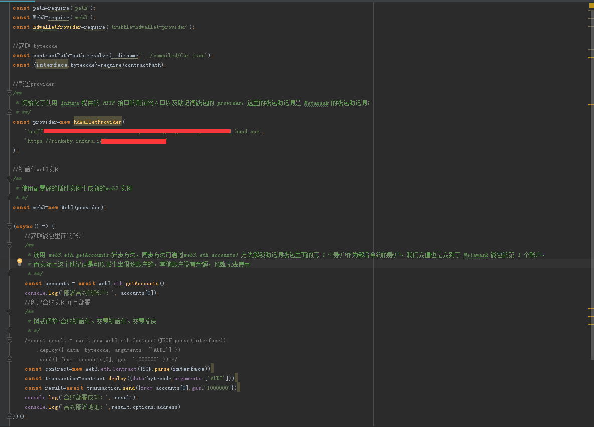
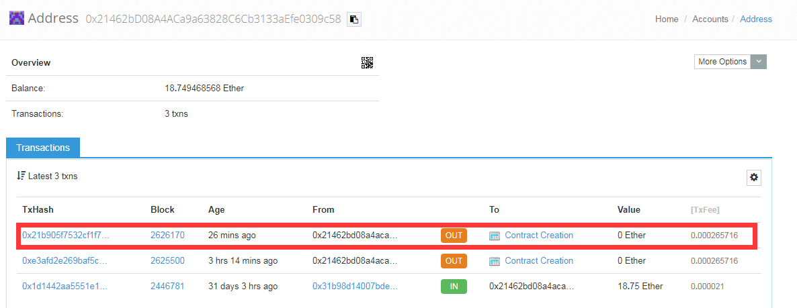

# 智能合约部署脚本
> 从Solidity源码中拿到机器码bytecode后，我们需要将它部署到以太网中。

## web3.js
> 链接前端与区块链的桥梁[web3.js](https://web3js.readthedocs.io/en/1.0/getting-started.html)

web3.js中包含了多个以太坊生态中不太功能的模块，其中包括:
1. web3-eth:方便 Javascript 和以太坊区块链通信，部署、调用智能合约
2. web3-utils:为 DApp 开发者提供了大量的工具函数
3. web3-shh:方便做基于 whisper 协议的 P2P 通信和广播
4. web3-bzz:方便做基于 swarm 协议的去中心化文件存储

web3.js通过插件机制（providers）和以太坊不同网络通信的模式：

## 部署的必要条件
> 客户端和以太坊网络的交互可以定性为接口调用或者交易，其中智能合约的部署属于交易。部署除了必须有bytecode外，还需发起交易的必要条件也满足：
1. 余额大于0的账户
2. 与目标网络的通信
> 区块链上的任何交易都会被发送到某个网络上，并被这个网络中的节点打包确认，所以可以考虑把智能合约部署到网络上。如何跟这个网络通信，惯常的做法是自己跑个节点，然后让节点加入到网络中，这样我们的交易通过自己运行的节点广播给网络中的其他节点，就能被打包确认。但是实际上自己跑节点成本还是很高的，先社区已有人做了以太坊网络的入口节点，并为开发者提供了接口直接调用，例如[Infura](https://infura.io/)
> 通过[https://infura.io/signup](https://infura.io/signup)注册完成后，infura就会向我们的邮箱发送每个网络的入口节点访问地址，之后我们选择Rinkeby入口地址。
## 编写智能合约部署脚本deploy.js

## 使用 etherscan 和 remix 等查看和测试合约实例
> 智能合约实例是存储在以太坊网络上的，查看合约实例通常的做法是通过etherscan、remix 去访问。当然也有通过代码的方式。

### 通过etherscan查看合约
>通过Metamask打开在etherscan上的主页即可查看到历史交易：

