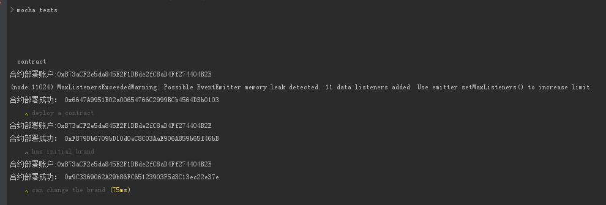

# 使用 mocha + web3.js + ganache 编写合约测试

## ganache-cli 
>ganache-cli是以太坊节点仿真器软件ganache的命令行版本，就像是 Remix 中运行在内存中的 Javascript VM 测试网络，其方法调用、交易确认速度非常快，可以方便开发者快速进行以太坊DApp的开发与测试。
>而 ganache-cli 为 web3.js 提供了兼容的 provider，这样就可以通过 web3.js 把合约部署到 ganache-cli 提供的本地测试网络上，并且跟合约实例交互。

## 跑测试
>测试时我们通常会把每次测试运行的环境隔离开，对应到智能合约测试，每次测试需要部署新的合约实例，然后针对新的实例做功能测试。
>测试内容：1.合约部署时传入的 brand 属性被正确存储；2.调用 setBrand 之后合约的 brand 属性被正确更新
````

const path=require('path')
const assert=require('assert')
const ganache=require('ganache-cli')
const Web3=require('web3')

//获取bytecode
const contractPath=path.resolve(__dirname,'../compiled/Car.json')
const {interface,bytecode}=require(contractPath)

//配置provider
const web3=new Web3(ganache.provider());

let accounts;
let contract;
let initialBrand='AUDI';

describe('contract',()=>{
    //跑单例时需要部署全新的合约实例，起隔离作用
    beforeEach(async()=>{
        accounts= await web3.eth.getAccounts()
        console.log('合约部署账户:'+accounts[0])

        contract=await new web3.eth.Contract(JSON.parse(interface))
            .deploy({data:bytecode,arguments:[initialBrand]})
            .send({from:accounts[0],gas:'1000000'});
        console.log('合约部署成功：',contract.options.address)
    })
    // 单元测试
    it('deploy a contract',()=>{
        assert.ok(contract.options.address)
    })

    //测试：合约部署时传入的 brand 属性被正确存储
    it('has initial brand',async()=>{
        //contract.methods.brand().call()，调用合约上的方法，通常是取数据，立即返回
        const brand=await contract.methods.brand().call()
        assert.equal(brand,initialBrand)
    })

    // 测试：调用 setBrand 之后合约的 brand 属性被正确更新
    it('can change the brand',async()=>{
        const newBrand='BWM'
        //contract.methods.setBrand('xxx').send()，对合约发起交易，通常是修改数据，返回的是交易 Hash
        await contract.methods.setBrand(newBrand).send({from:accounts[0]})
        const brand=await contract.methods.brand().call()
        assert.equal(brand,newBrand)
    })

})


````
## 测试截图：


